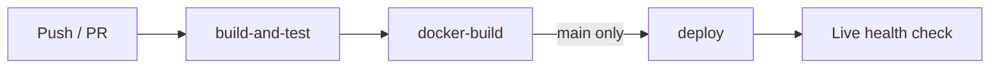

# my-flask-app


A Flask web service built to demonstrate a complete CI/CD and DevSecOps workflow: every push is tested, linted, security scanned, containerized, smoke tested, and (on `main`) continuously deployed to a live host with automated health verification.

**Live health check:** https://my-flask-app-9oaw.onrender.com/health

## Pipeline



Defined in [`.github/workflows/ci.yml`](.github/workflows/ci.yml). Each stage only runs if the previous one passes.

### 1. build-and-test
| Check | Tool | Gate |
|---|---|---|
| Unit tests + coverage | pytest, pytest-cov | Fails below 75% coverage |
| Linting | flake8 | Max line length 100 |
| Formatting | black | `--check` must pass |
| Static security analysis | Bandit | Medium severity and above |
| Dependency vulnerabilities | pip-audit | Any known CVE fails the build |

The coverage report is uploaded as a build artifact.

### 2. docker-build
- Builds the image tagged with the commit SHA
- Starts the container and calls `/health` to confirm it actually runs before anything is deployed

### 3. deploy (main branch only)
- Triggers a Render deployment through a deploy hook stored as a GitHub secret
- Waits for the rollout, then verifies the live `/health` endpoint

## Infrastructure as Code (Terraform)

[`terraform/`](terraform/) manages the repository itself as code:
- Repository settings (visibility, issues, delete branch on merge)
- Branch protection on `main`: requires the `build-and-test` and `docker-build` checks to pass, requires a pull request review, and dismisses stale reviews

## Kubernetes

[`k8s/`](k8s/) contains manifests tested locally on minikube:
- **Deployment:** 3 replicas, liveness and readiness probes on `/health`, CPU and memory requests and limits
- **Service:** NodePort exposing port 80 to container port 5000

## API

| Endpoint | Description |
|---|---|
| `GET /` | Hello message |
| `GET /health` | Health check used by the pipeline, Docker smoke test, and Kubernetes probes |
| `GET /version` | App version and environment |

## Run it locally

```bash
# App and tests
pip install -r requirements.txt
python app.py              # http://localhost:5000
pytest --cov=app

# Docker
docker build -t my-flask-app .
docker run -p 5000:5000 my-flask-app

# Kubernetes (minikube)
minikube start
eval $(minikube docker-env)
docker build -t my-flask-app:latest .
kubectl apply -f k8s/
minikube service flask-app-service

# Terraform
cd terraform
export TF_VAR_github_token=<your token>
terraform init
terraform plan -var="github_owner=<your username>"
```

## Tech stack

Python 3.11 · Flask · pytest · GitHub Actions · Docker · Kubernetes · Terraform · Bandit · pip-audit · Render
